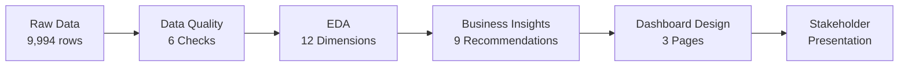

# 📊 Superstore Business Analysis — Portfolio Page

> **A McKinsey-Grade Business Analysis Project**  
> From raw data to $286K profit insights in 12 dimensions

---

## 🏢 Business Background

**Superstore** is a fictional US-based retail company selling furniture, office supplies, and technology products across four regions (West, East, Central, South) to three customer segments (Consumer, Corporate, Home Office).

### The Business Problem

The company is growing revenue but management lacks visibility into:
- **Where is profit leaking?** (18.7% of transactions are loss-making)
- **Which products deserve investment?** (vs. which should be discontinued)
- **How do discounts impact the bottom line?** (40%+ discounts destroy value)
- **Which regions and segments are most profitable?**

### My Role

As the **Business Analyst**, I conducted a full-cycle analysis:
1. Defined KPIs aligned with business objectives
2. Audited data quality (6 checks)
3. Performed multi-dimensional EDA (12 analyses)
4. Generated 9 actionable business recommendations
5. Designed a Power BI dashboard blueprint

---

## 🔄 Workflow



### Methodology

| Step | Method | Tool |
|------|--------|------|
| Business Understanding | KPI framework, stakeholder mapping | — |
| Data Quality | Missing, duplicates, outliers (IQR), negative values | Python |
| EDA | Group-by, aggregation, Pareto, margin analysis | Python + Plotly |
| Insight Generation | McKinsey "Insight → So What → Now What" | — |
| Visualization | 12 interactive Plotly charts | Plotly |
| Dashboard | 3-page Power BI blueprint | Power BI design |

---

## 📊 Dashboard Blueprint (Power BI)

### Page 1: Executive Summary
```
┌─────────────────────────────────────────────────┐
│  KPI CARDS                                       │
│  [$2.30M Sales] [$286K Profit] [12.5% Margin]   │
│  [9,994 Orders] [$230 Avg Order] [18.7% Loss]   │
├────────────────────┬────────────────────────────┤
│  Sales Trend       │  Profit by Category        │
│  (Area Chart)      │  (Waterfall)               │
├────────────────────┴────────────────────────────┤
│  Regional Heat Map with conditional formatting   │
└─────────────────────────────────────────────────┘
```

### Page 2: Product Performance
```
┌─────────────────────────────────────────────────┐
│  Top 10 Sub-Categories by Sales (Bar)            │
├────────────────────┬────────────────────────────┤
│  Bottom 10 by      │  Discount vs Profit         │
│  Profit (Bar)      │  (Scatter Plot)             │
├────────────────────┴────────────────────────────┤
│  Pareto Chart (80/20 Analysis)                   │
└─────────────────────────────────────────────────┘
```

### Page 3: Deep-Dive Analysis
```
┌─────────────────────────────────────────────────┐
│  Slicers: [Region] [Category] [Segment] [Date]   │
├────────────────────┬────────────────────────────┤
│  Segment Donut     │  Ship Mode Breakdown        │
├────────────────────┴────────────────────────────┤
│  Category Margin Matrix (Heatmap)                │
├─────────────────────────────────────────────────┤
│  Detailed Transaction Table (with drill-through) │
└─────────────────────────────────────────────────┘
```

### Color Palette (McKinsey-Inspired)
- **Primary**: Deep Navy `#003366`
- **Secondary**: Medium Blue `#0066CC`
- **Profit/Positive**: Green `#00A86B`
- **Loss/Negative**: Red `#DC3545`
- **Warning**: Amber `#FFC107`
- **Background**: White `#FFFFFF` / Light Gray `#F8F9FA`

---

## 💡 Key Business Insights

### 1. The Profit Leakage Problem
> **18.7% of transactions lose money, costing $156,131.**  
> This is the single biggest issue facing the business.

**Recommendation**: Launch "Stop the Bleeding" initiative — cap discounts at 30% for low-margin products, require manager approval for discounts >40%.

### 2. Discount: The Silent Profit Killer
> **Orders with 40%+ discount have -40.7% margin.**  
> Deep discounting doesn't drive enough volume to compensate.

**Recommendation**: Implement tiered discount policy based on product margin. A/B test optimal discount levels.

### 3. The 80/20 Rule Holds
> **A small group of sub-categories drives 80% of revenue.**  
> The long tail consumes resources with minimal return.

**Recommendation**: Apply portfolio management — protect Stars, maintain Cash Cows, evaluate Question Marks for discontinuation.

### 4. Regional Performance Gap
> **West region leads with highest margins; Central trails.**  
> Geographic concentration is both an opportunity and a risk.

**Recommendation**: Double down on strong markets while diagnosing underperformers.

---

## 🤖 AI Workflow (Future Enhancement)

This project is designed to integrate with AI/ML capabilities:

```
Current State (Descriptive)           Future State (Predictive)
─────────────────────────           ─────────────────────────
✓ What happened?                    → What will happen?
✓ Where is profit leaking?          → Which orders will be unprofitable?
✓ Which products underperform?      → Optimal discount by product?
✓ Who are our customers?            → Customer lifetime value prediction?
                                    → Churn risk scoring?
                                    → Automated recommendation engine?
```

**Tech Stack for AI Enhancement**:
- `scikit-learn` — Classification/Regression models
- `Prophet` / `statsmodels` — Time-series forecasting
- `Streamlit` — Interactive ML dashboard
- `LangChain` — LLM-powered business narrative generation

---

## 📋 Project Summary

| Metric | Value |
|--------|-------|
| **Dataset Size** | 9,994 transactions |
| **Analysis Dimensions** | 12 |
| **Business Insights** | 9 with actionable recommendations |
| **Charts Generated** | 12 (Plotly, interactive) |
| **Code Files** | 8 Python modules |
| **Code Quality** | PEP 8, modular, documented |
| **Key Finding** | 18.7% transactions are loss-making due to deep discounting |
| **Profit Improvement Opportunity** | ~$47K/year (stopping 30% of losses) |

---

## 🎯 Skills Demonstrated

| Skill | Evidence |
|-------|----------|
| **Business Analysis** | KPI framework, stakeholder thinking, ROI calculation |
| **Data Analysis** | Group-by aggregation, Pareto, margin analysis, IQR method |
| **Python** | 500+ lines production code, modular architecture |
| **Data Visualization** | 12 Plotly chart types, McKinsey color palette |
| **Dashboard Design** | 3-page Power BI blueprint with KPIs and drill-through |
| **Statistical Thinking** | Descriptive statistics, outlier detection, 80/20 rule |
| **Communication** | Insight → Recommendation framework, executive-ready findings |

---

<p align="center">
  <b>Built with ❤️ for the AI + Business Analyst career path</b><br>
  <sub>Yao Jiahan · Applied Statistics, B.Sc. · 2026</sub>
</p>
